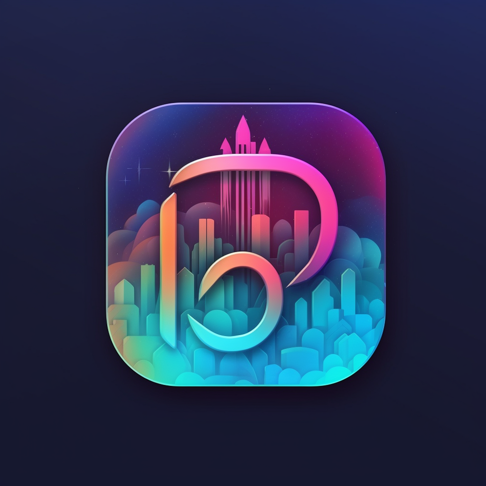

# Dream Protocol 
started at Jun. 3th, 2023.

### What is Dream Factory?
Dream Factory is a decentralized AI-generated content protocol (Currently based on stable diffusion) that encompasses various roles, including creators, shared computing nodes, and community users. 
It provides the latest and most comprehensive model style libraries and the cheapest model services, allowing everyone to enjoy the benefits of AI development and grow together with AI.

### Background
With the emergence of AIGC projects such as Stable Diffusion and ChatGPT, new opportunities and challenges have arisen. 
The relationship between humans and AI has been disrupted, making it important for people to examine and reevaluate their relationship with AI. 
In the field of image generation, there are also concerns about copyright and intellectual property.
As a leading project in text-to-image generation, Stable Diffusion enables stand-alone deployment and model training, making it a game-changer in the industry.

#### So what is Dream Protocol?
Dream Protocol, a new blockchain-based consensus mechanism, provides a solution to these issues. 
It shares global GPU computing resources and converts AI style models into NFTs to protect intellectual property. 
In addition to offering cheaper model calling costs through GPU sharing, 

What's more, Dream Protocol provides the most comprehensive model library for users. 
Generative AI (AIGC) currently requires significant amounts of material to create stylized images during training, 
but the copyright of these materials is disputed. 
At Dream Factory, we have implemented a tokenomics commission mechanism for AI model usage.
When an AI model uses a creator's image for training and generates income, 
the creator receives a portion of the earnings. 
We believe that people should make decisions about how to use AI, and AI is just a tool. 
With Dream Factory, all creators can concentrate on innovation.
Based on tokenomics, model owners and the community work together to create Fine-Tuning models, share profits, 
and promote AI content production, while protecting the interests of content creators.

#### How it works?
TBD

#### Summary
Dream Protocol offers cheaper model calling and more extensive model libraries. 
It is the main goal of this hackathon demo to realize the GPU computing power sharing part of the above content.

### Logo

Prompt: Dream Protocol 1024*1024 web application logo

### Roadmap
TBD

### Citation
This software uses the following open-source software:

* [Substrate: The platform for blockchain innovators](https://github.com/paritytech/substrate)

## Buidl durning Hackathon

**Frontend**

- `Dapp`
  - [ ] Integrate stable diffusion web ui.
  - [ ] Design front-end interactions.
  - [ ] interaction with blockchain.

**Blockchain**

- worker
  - [ ] Develop stable duffusion into a worker and interact with the blockchain.

- blockchain
  - [ ] Access stable diffusion through Offline worker.
  - [ ] Storage generated images to IPFS.
  - [ ] Develop functions for generating images & unittest
  - [ ] deploy on GPU server

**Business**
  - [ ] Roadmap.
  - [ ] Simplified tokenomics design.
  - [ ] demo video
  - [ ] demo pitch

## Members of team

Henry [@onehumanbeing](https://github.com/onehumanbeing), Full-stack developer & web2/3 Entrepreneur. 
Winner of NEAR metabuild Hackathon III (@WaverFinance), Co-founder of NEAR Tinker Union. 